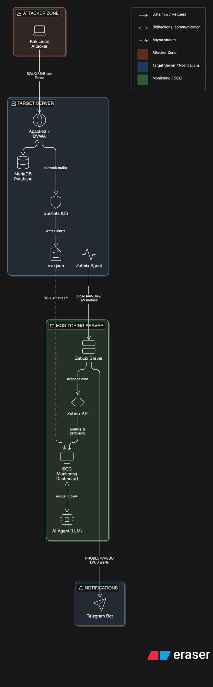
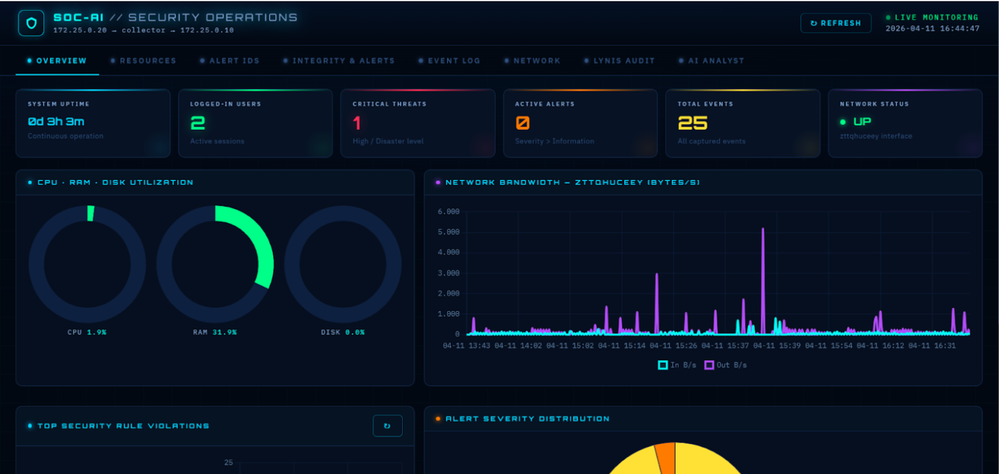
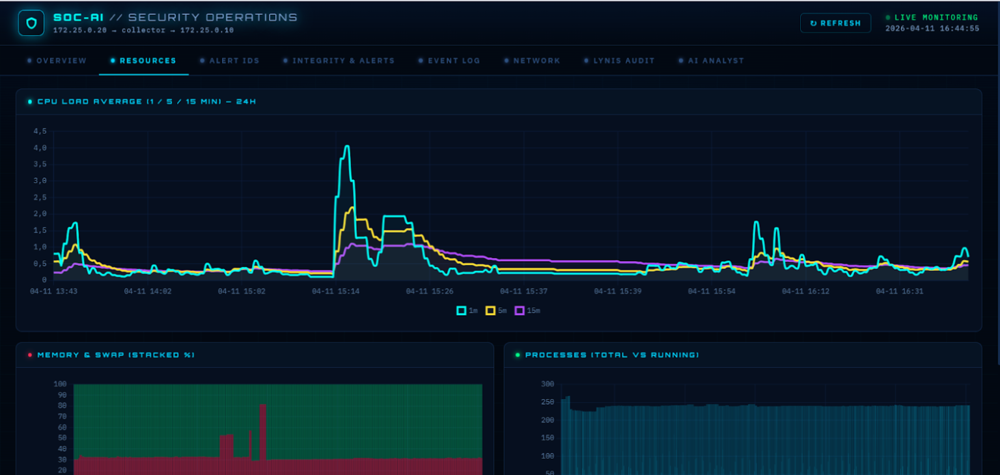
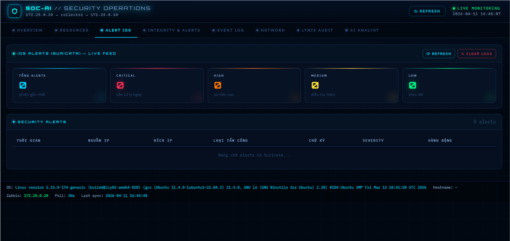
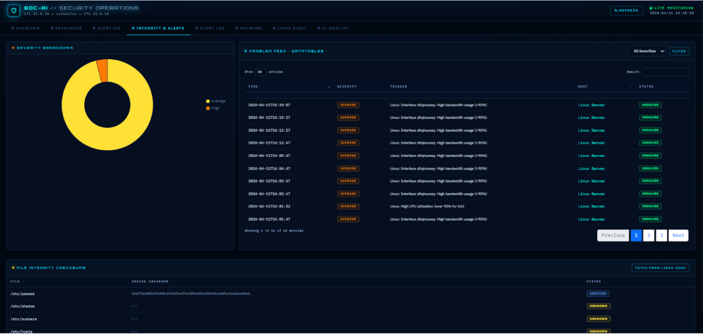
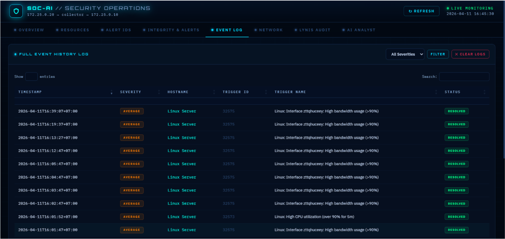
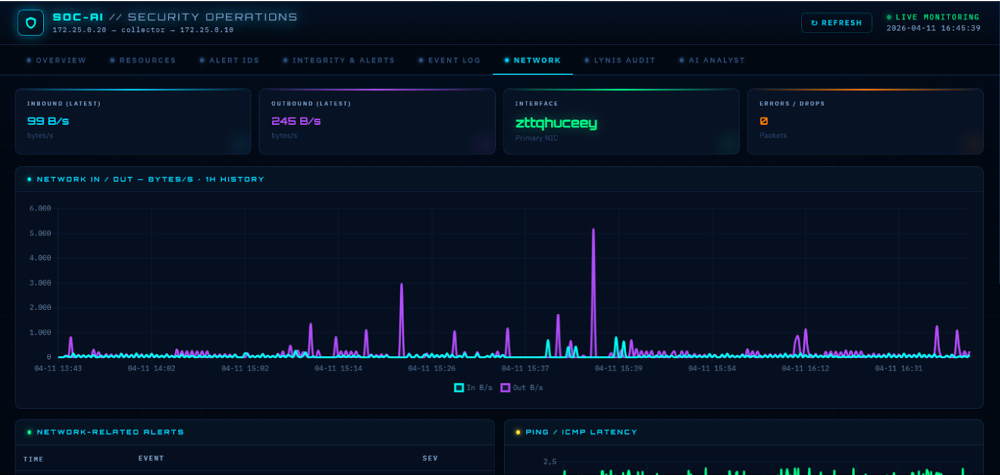
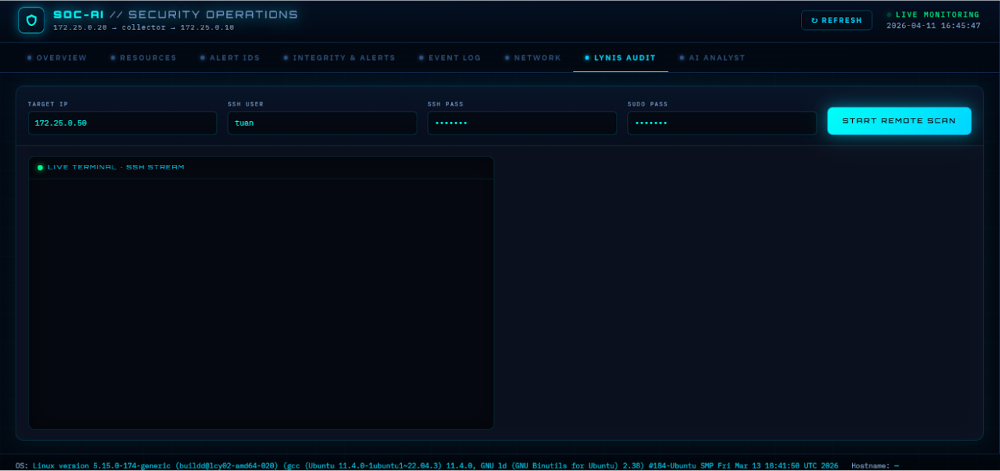
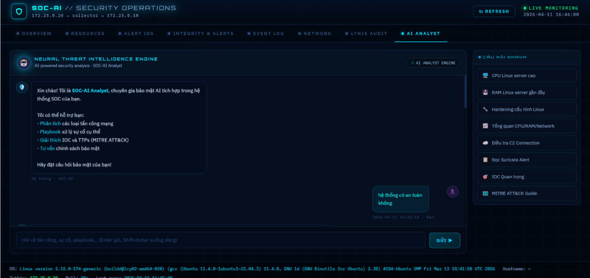
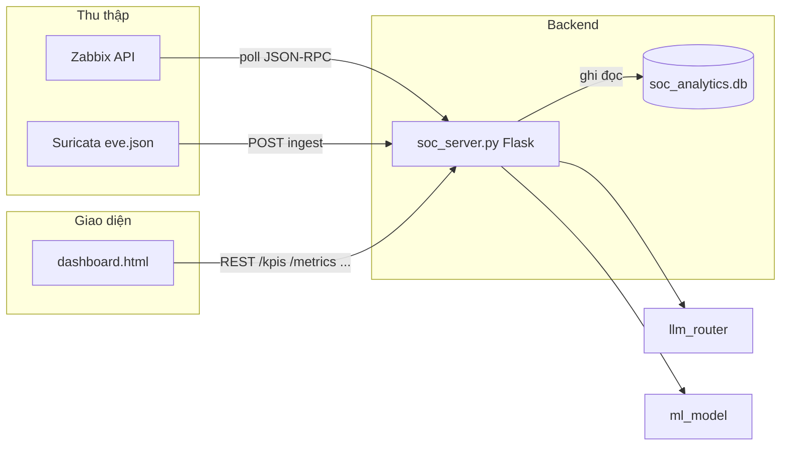

<div align="center">

# SOC Dashboard — Zabbix & tích hợp an ninh

**Bảng điều khiển SOC** thu thập cảnh báo và metric từ **Zabbix** (JSON-RPC), lưu **SQLite**, hiển thị dashboard SPA; tùy chọn **Suricata**, **LLM phân tích**, **Lynis qua SSH**, **Telegram**.

[](https://www.python.org/)
[](https://flask.palletsprojects.com/)


</div>

---

## Mục lục

- [Tổng quan hệ thống](#tổng-quan-hệ-thống)
- [Kiến trúc & luồng dữ liệu](#kiến-trúc--luồng-dữ-liệu)
- [Cấu trúc thư mục](#cấu-trúc-thư-mục)
- [Yêu cầu & cài đặt](#yêu-cầu--cài-đặt)
- [Cấu hình (biến môi trường)](#cấu-hình-biến-môi-trường)
- [Khởi động hệ thống](#khởi-động-hệ-thống)
- [URL & API](#url--api)
- [Tài liệu thêm](#tài-liệu-thêm)

---
## Kiến trúc hệ thống


## Giao diện dashboard








## Tổng quan hệ thống

Dự án là một **trung tâm giám sát SOC** tập trung vào:

| Thành phần | Mô tả ngắn |
|------------|------------|
| **Zabbix** | Collector định kỳ gọi API (`user.login` → `problem.get` → `item.get` / `history.get`), đồng bộ vào SQLite |
| **Dashboard** | Giao diện `dashboard.html`: tổng quan bảo mật, AI analyst, metric thời gian thực, timeline sự kiện |
| **Suricata** | Agent Linux đọc `eve.json`, gửi sự kiện IDS về API ingest của Flask |
| **AI / ML** | Chat phân tích qua `llm_router`; anomaly / giải thích qua `ml_model` (Isolation Forest) |
| **Lynis** | Quét hardening từ xa qua SSH, stream kết quả SSE |
| **Telegram** | Thông báo cảnh báo Zabbix (từ server hoặc script notifier riêng) |

**Kho dữ liệu chính:** file SQLite `soc_analytics.db` (đường dẫn có thể đổi bằng `SOC_ANALYTICS_DB_PATH`). File được tạo khi chạy; không nên commit DB production lên Git.

---

## Kiến trúc & luồng dữ liệu



Luồng chi tiết (Suricata, Lynis SSE, Telegram) được mô tả trong **[SOC_SYSTEM_ARCHITECTURE.md](./SOC_SYSTEM_ARCHITECTURE.md)**.

---

## Cấu trúc thư mục

```
NOC/
├── soc_server.py              # Flask app chính — API + collector Zabbix
├── zabbix_client.py           # Client JSON-RPC Zabbix
├── soc_db.py                  # SQLite — schema & CRUD
├── ml_model.py                # Anomaly / giải thích cảnh báo
├── llm_router.py              # Định tuyến LLM (Gemini / Groq / OpenRouter)
├── lynis_service.py           # Lynis qua SSH + SSE
├── zabbix_web_view.py         # App nhẹ port 5001 — xem nhanh Zabbix
├── zabbix_telegram_notifier.py
├── suricata_forwarder.py      # Chạy trên Linux — đẩy eve.json lên SOC
├── dashboard.html             # SPA dashboard
├── start_server.bat           # (thường tạo ở máy local; có thể không có trên GitHub nếu bị .gitignore)
├── requirements.txt
├── README.md
└── SOC_SYSTEM_ARCHITECTURE.md # Kiến trúc & onboarding code
```

---

## Yêu cầu & cài đặt

1. **Python 3.10+** (khuyến nghị bản ổn định mới nhất trên Windows).
2. Clone hoặc tải mã nguồn về thư mục làm việc.
3. Tạo virtualenv (khuyến nghị) và cài dependency:

```powershell
cd path\to\NOC
python -m venv .venv
.\.venv\Scripts\Activate.ps1
pip install -r requirements.txt
```

> **Ghi chú:** Server production trên Windows dùng **Waitress** (xem `start_server.bat`). `gunicorn` trong comment của `requirements.txt` chỉ phù hợp Linux/Mac.

---

## Cấu hình (biến môi trường)

Đặt biến trước khi chạy (PowerShell: `$env:ZABBIX_USERNAME="..."` hoặc file `start_server.local_env.bat`). Các file như `start_server.local_env.bat`, `.env` nên **không commit** — trong dự án đã liệt kê trong `.gitignore`.

### Zabbix & collector

| Biến | Mô tả | Mặc định (tham khảo trong code) |
|------|--------|----------------------------------|
| `ZABBIX_API_URL` | URL endpoint `api_jsonrpc.php` | `http://172.25.0.20/zabbix/api_jsonrpc.php` |
| `ZABBIX_USERNAME` | User đăng nhập API | `Admin` |
| `ZABBIX_PASSWORD` | Mật khẩu API | `zabbix` |
| `ZABBIX_HOST_NAME` | Host lọc metric (nếu dùng) | `Linux Server` |
| `ZABBIX_POLL_INTERVAL_SEC` | Chu kỳ poll (giây) | `30` |

### Ứng dụng & database

| Biến | Mô tả |
|------|--------|
| `SOC_ANALYTICS_DB_PATH` | Đường dẫn file SQLite |
| `APP_HOST` / `APP_PORT` | Host/port cho script khởi động tùy chỉnh (nếu có) |

### AI chat

| Biến | Mô tả |
|------|--------|
| `SOC_CHAT_MODE` | Đặt `llm` để bật gọi LLM qua `llm_router` |
| `GEMINI_API_KEY` / `GROQ_API_KEY` / `OPENROUTER_API_KEY` | Khóa provider tương ứng |

### Suricata ingest

| Biến | Mô tả |
|------|--------|
| `SOC_INGEST_TOKEN` | Token bảo vệ endpoint ingest (nên đặt khi expose mạng) |

### Telegram & notifier

| Biến | Mô tả |
|------|--------|
| `TELEGRAM_BOT_TOKEN` / `TELEGRAM_CHAT_ID` | Bật gửi Telegram từ `soc_server` khi đủ cặp biến |
| `RUN_TELEGRAM_NOTIFIER` | Đặt `1` trước khi chạy script khởi động để bật thêm `zabbix_telegram_notifier.py` |

**Bảo mật:** không commit token, mật khẩu Zabbix, hay API key. Chỉnh `start_server.bat` cho môi trường lab hoặc dùng file env riêng.

---

## Khởi động hệ thống

### Cách 1 — Chạy thủ công (mọi clone từ GitHub / Linux / debug)

Dùng khi **chưa có** script Windows tùy chỉnh hoặc khi deploy không dùng `.bat`.

**Terminal 1 — SOC server**

PowerShell:

```powershell
$env:SOC_ANALYTICS_DB_PATH = "$PWD\soc_analytics.db"
$env:ZABBIX_API_URL = "http://<zabbix-host>/zabbix/api_jsonrpc.php"
$env:ZABBIX_USERNAME = "Admin"
$env:ZABBIX_PASSWORD = "<password>"
python -m waitress --host=0.0.0.0 --port=5000 soc_server:app
```

Bash (Linux):

```bash
export SOC_ANALYTICS_DB_PATH="$PWD/soc_analytics.db"
export ZABBIX_API_URL="http://<zabbix-host>/zabbix/api_jsonrpc.php"
export ZABBIX_USERNAME="Admin"
export ZABBIX_PASSWORD="<password>"
python -m waitress --host=0.0.0.0 --port=5000 soc_server:app
```

**Terminal 2 — Zabbix Web View** (tùy chọn, cổng mặc định thường là **5001**):

```powershell
python zabbix_web_view.py
```

Mở trình duyệt: `http://localhost:5000/` (dashboard), `http://localhost:5000/health` (kiểm tra), và nếu đã bật web view: `http://localhost:5001/api/zabbix`.

> Truy cập từ máy khác trong LAN: thay `localhost` bằng **IP máy chạy server**, mở firewall cho cổng **5000** và **5001**.

### Cách 2 — Windows: script `start_server.bat` (máy local)

Nhiều team tạo file **`start_server.bat`** cục bộ để set biến môi trường, mở browser và `start` từng tiến trình (Waitress + `zabbix_web_view.py` + tùy chọn Telegram). File này **có thể không có trong bản clone** nếu bị `.gitignore` (tránh lộ URL/mật khẩu). Khi đã có file trên máy bạn:

```powershell
.\start_server.bat
```

Nội dung tối thiểu cần trong script: đặt `SOC_ANALYTICS_DB_PATH`, thông tin Zabbix, rồi hai lệnh tương đương **Cách 1** (Waitress port **5000** + `python zabbix_web_view.py`).

---

## URL & API

| Mục đích | URL / phương thức |
|----------|-------------------|
| Dashboard chính | `GET http://localhost:5000/` |
| Health check | `GET http://localhost:5000/health` |
| Zabbix Web View (API nhanh) | `http://localhost:5001/api/zabbix` (khi chạy `zabbix_web_view.py`) |
| Kích hoạt một vòng collector | `POST /collector/run` |
| KPI cards | `GET /kpis` |
| Top trigger / rule | `GET /top-rules` |
| Chuỗi CPU/RAM/NET | `GET /metrics` |
| Lịch sử (lọc severity, ví dụ High) | `GET /history?severity=High` |
| AI analyst (ngữ cảnh sự kiện) | `POST /chat` |

**Suricata (Linux):** sau khi SOC lên, forwarder có thể chạy tương tự:

```bash
python3 suricata_forwarder.py --url http://<soc-host>:5000 --log /var/log/suricata/eve.json
```

Tham số đầy đủ xem `--help` trong `suricata_forwarder.py`.

---

## Tài liệu thêm

- **[SOC_SYSTEM_ARCHITECTURE.md](./SOC_SYSTEM_ARCHITECTURE.md)** — cây module, luồng Zabbix/Suricata/Lynis/Telegram, danh biến môi trường, thứ tự đọc code.

---

<div align="center">

**Đồ án / NOC**

</div>
